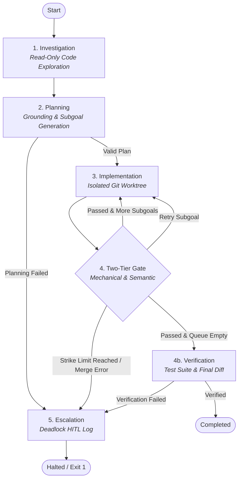
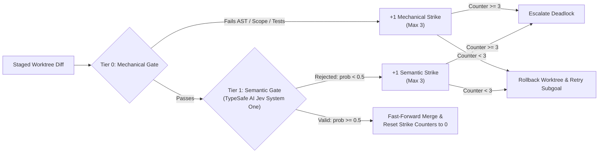

# Jev State Engine

A deterministic, finite-state machine (FSM) runtime that orchestrates autonomous software engineering tasks. Built on LangGraph, the engine couples an untrusted worker LLM with strict Inversion of Control (IoC), real Git worktree isolation, multi-ecosystem mechanical validation, and TypeSafe AI's Jev System One semantic gatekeeper.



---

## Architecture & Design Philosophy

Autonomous coding agents typically suffer from cascading hallucination: an unstructured model loop writes unconstrained diffs, introduces silent syntax breaks, wanders outside task scope, and hallucinates non-existent dependencies or file locations.

**Jev State Engine enforces Inversion of Control (IoC):**

* **Deterministic FSM as Master (LangGraph):** The model never dictates execution flow or lifecycle boundaries. State transitions, turn budgets, strike counters, and checkpoint persistence are strictly managed by a deterministic state machine.
* **Worker LLM as Untrusted Generator:** The worker model (e.g. Gemini 3.5 Flash Lite) is invoked only inside tightly controlled sandbox states with scoped tool bindings. In Investigation, it possesses strictly read-only tools. In Implementation, it operates solely inside an isolated Git worktree.
* **Gatekeeper as Authoritative Judge (TypeSafe AI):** Code is never committed to the target branch upon model output alone. Every staged diff must first pass deterministic mechanical validation (Tier 0), followed by an external, calibrated boolean evaluation by TypeSafe AI's Jev System One model (Tier 1).

---

## State Machine Pipeline

The runtime implements a 5-state deterministic state machine:

### 1. Investigation (`node_investigate`)
Explores the target codebase to understand existing conventions, architecture, and file paths before proposing modifications.
* **Strict Read-Only Toolset:** The worker is bound exclusively to `list_dir`, `grep`, `read_file`, and `finish_investigation`. Write operations are physically omitted from the LLM tool bindings.
* **Path Confinement:** Every tool call strictly enforces relative path traversal guards; access attempts escaping the repository root fail closed immediately.
* **Turn Budget:** Bounded to a 20-turn maximum cap. If the worker fails to call `finish_investigation` within the turn cap, `investigation_incomplete` is set to `True`, triggering cautious planning constraints.
* **Grounding Discovery:** Populates `investigation_notes` and tracks `investigated_directories` for architectural grounding downstream.

### 2. Planning (`node_plan`)
Deconstructs the ticket into an ordered queue of atomic subgoals.
* **Structured Subgoal Validation:** Enforces a strict Pydantic contract (`Subgoal`):
  * `description`: Explicit statement of the atomic modification.
  * `scope`: Non-empty list of exact file paths to touch or create.
  * `expects_tests`: Boolean indicating whether automated unit tests are expected to verify this step.
* **Architectural Grounding Guard:** The planner strictly verifies that scopes reference files discovered during Investigation or explicitly stated in the ticket. It rejects hallucinated files, arbitrary language extension assumptions, and uninvestigated directory targets.
* **`expects_tests` Criteria:** Automatically qualified as `False` for docstrings, comments, formatting, or projects lacking a test framework, and `True` for verifiable logic changes.
* **Error Self-Correction & Routing:** Retries once with explicit validation diagnostics upon JSON or schema errors; transitions immediately to `implement` if valid or `escalate` if planning fails.

### 3. Implementation (`node_implement`)
Applies code mutations for the active subgoal inside an isolated Git worktree.
* **Worktree Isolation:** Creates a dedicated branch (`jev-subgoal-<id>`) and worktree (`.jev-worktrees/subgoal-<id>`), shielding the main repository from dirty working tree state.
* **Restricted Mutation Tools:** Provides `stage_file_mutation` and `submit_subgoal`.
* **Scope-Aware Prompt Injection:** Automatically reads and injects the current content of all in-scope files and previous gate feedback into the worker context.

### 4. Gating (`node_gate`)
Evaluates the staged worktree mutation through Tier 0 and Tier 1 gates.
* **On Pass:** Executes a fast-forward merge (`git merge --ff-only`) into the main repo, cleanly discards the worktree, prunes git refs, resets strike counters to 0, and advances to the next subgoal.
* **On Fail:** Discards the worktree without leaking artifacts to main, increments the failure tier's strike counter, logs diagnostic feedback, and routes back to `implement` for retry.

### 5. Verification & Completion (`node_verify`)
Validates repository-level integrity once the subgoal queue is exhausted.
* **Multi-Ecosystem Test Suite:** Executes full repository test suites on `repo_dir`.
* **Untested Pass Handling:** Correctly qualifies tickets lacking automated tests, docs-only modifications, or framework-less projects as valid untested passes.
* **Final Ticket Verification:** Dispatches ticket description, cumulative git diff, test output, and investigation notes to Jev Gatekeeper (`verify_ticket`) for final sign-off.
* **Halt / Completion:** Transitions to `END` on status `completed`, or routes to `escalate` upon verification rejection.

### Escalation (`node_escalate`)
Deadlock circuit breaker and safe fallback handler.
* Cleans up active worktrees and restores workspace pointers to `repo_dir`.
* Serializes the complete execution trajectory, failure nodes, and triggering tier into `escalation.log` for Human-in-the-Loop (HITL) review.

---

## Two-Tier Gating & Circuit Breakers

Before any code commits to the base repository, it must clear two independent verification tiers:



### Tier 0: Mechanical Gating
Runs purely local, deterministic checks before touching external networks or APIs:
1. **AST Syntax Validation:** Executes `ast.parse` over all touched Python source files, instantly flagging syntax regressions while safely skipping virtual environments, cache directories, and vendor paths.
2. **Scope Creep Enforcement (`check_scope`):** Extracts touched files from `git diff` and validates them against the subgoal's declared `scope`. Any modification outside declared files triggers an immediate mechanical failure.
3. **Multi-Ecosystem Test Execution:** Automatically detects and runs native test suites based on repository manifests:
   * **Node.js / TypeScript:** `package.json` test scripts with automatic package manager detection (`yarn test`, `pnpm test`, or `npm test`).
   * **Go:** `go.mod` (`go test ./...`).
   * **Rust:** `Cargo.toml` (`cargo test`).
   * **Java (Maven):** `pom.xml` (`mvn test` or `./mvnw test` / `mvnw.cmd`).
   * **Java/Kotlin (Gradle):** `build.gradle` / `build.gradle.kts` (`gradle test` or `./gradlew test` / `gradlew.bat`).
   * **Python:** `pytest.ini`, `pyproject.toml` (`[tool.pytest]`), or auto-discovered test directories (`test_*.py`, `*_test.py`, `tests/`).
   * **Infrastructure as Code (IaC):** Terraform (`terraform validate`), Ansible (`ansible-lint` / `ansible-playbook --syntax-check`), and Helm (`helm lint`).
4. **Docs-Only Diff Classification (`_is_docs_only_diff`):** Uses lexical and AST-level comment analysis (supporting Markdown, TypeScript/JavaScript block/line comments, and Python docstrings/comments). When a diff modifies only documentation or comments without altering executable logic, it permits an untested pass even if no unit tests run.
5. **Configurable Test Execution Policy (`--test-policy`):** Controls when and if native test runners execute during mechanical checks:
   * **`auto` (Default):** Honors `subgoal.expects_tests`. When a subgoal does not expect tests (`expects_tests == False`), intermediate mechanical checks skip running test suites.
   * **`verify-only`:** Skips test execution during intermediate subgoals to accelerate development on large repos, running the full test suite once during final verification (`node_verify`).
   * **`never`:** Disables test runner execution completely (intermediate and final verification), qualifying as an untested pass while still strictly enforcing AST syntax (`check_build`), compilation / typechecks (`check_compile`), and scope creep validation.
   * **`always`:** Enforces running the full test suite on every single subgoal regardless of `subgoal.expects_tests`.

### Tier 1: Semantic Gating
When Tier 0 passes, the staged diff is sent to TypeSafe AI's Jev System One classifier:
* **Target Endpoint:** Configured via `JEV_API_URL` (defaulting to `https://api.typesafe.ai/v1/systemone`).
* **Calibrated Boolean Question (`noul`):** Queries `jev-latest` with the subgoal description, declared scope, staged diff, and investigation context:
  > *"Does the diff fully and correctly implement the subgoal described in state, without exceeding its declared scope?"*
* **Probability Verdict:** Evaluates the calibrated probability score (valid when $\ge 0.5$ or explicit boolean verdict). The gatekeeper ensures the diff implements the feature completely and correctly without side-effects or style-guide violations.

### Independent Strike Counters
* `mechanical_strike_count` (budget: 3 strikes)
* `semantic_strike_count` (budget: 3 strikes)

Mechanical build and syntax failures do not consume semantic validation budgets, and semantic rejections do not penalize mechanical budgets. Clearing any subgoal resets **both** strike counters to 0. Exceeding 3 strikes on either tier trips the circuit breaker and triggers immediate escalation.

---

## Git Worktree Isolation Mechanics

The engine isolates every code modification inside dedicated Git worktrees:

```
<repo-root>/
├── .git/
│   └── info/exclude        <-- Automatically excludes .jev-worktrees/
├── .jev-worktrees/
│   └── subgoal-<id>        <-- Isolated worktree on branch 'jev-subgoal-<id>'
├── src/
└── ...
```

1. **Worktree Creation:** In `node_implement`, `workspace.create_subgoal_worktree(subgoal_id)` creates `.jev-worktrees/subgoal-<subgoal_id>` branched off current `HEAD`.
2. **Safe Staging:** Mutations generated via `stage_file_mutation` modify only files in the worktree directory. The primary repository remains pristine.
3. **Atomic Merge on Gate Pass:**
   * Changes in the worktree are committed.
   * Merged into the main branch via fast-forward only:
     ```bash
     git merge --ff-only jev-subgoal-<id>
     ```
   * The worktree is removed (`git worktree remove --force`), pruned (`git worktree prune`), and the temporary branch is deleted (`git branch -D`).
4. **Clean Discard on Gate Fail:**
   * If a gate fails, `workspace.discard_subgoal_worktree()` strips the worktree directory, prunes worktree metadata, and drops the temporary branch without leaving any dirty state in the main repository.

---

## State Persistence & Checkpointing

The engine uses a dedicated SQLite checkpointer (`SqliteSaver`) built on LangGraph's `BaseCheckpointSaver`:
* **WAL Mode Concurrency:** Configured with `PRAGMA journal_mode = WAL` and thread-safe reentrant locks (`threading.RLock`).
* **Database Schema:** Persists serialized state dictionaries, metadata, and task-channel writes across two tables (`checkpoints` and `checkpoint_writes`).
* **Session Resumption:** Runs are keyed by `--thread-id`. If an execution halts, crashes, or is paused for HITL review, providing the same `--thread-id` restores the complete FSM state, plan queue, strike history, and trajectory.

---

## Prerequisites & Environment Setup

### Prerequisites
* Python 3.10+ (tested through Python 3.13)
* Git 2.25+ installed and available in `PATH`
* Node.js, Go, Rust, Java, or Terraform CLI (only if working with repositories in those respective ecosystems)

### Installation
```bash
git clone https://github.com/davyjones7321/jev-state-engine.git
cd jev-state-engine

# Create and activate virtual environment
python -m venv .venv

# Windows:
.venv\Scripts\activate
# macOS/Linux:
source .venv/bin/activate

# Install dependencies
pip install -r requirements.txt
```

### Environment Configuration
Create a `.env` file in the project root:

```env
# TypeSafe AI Jev System One Configuration
JEV_API_URL=https://api.typesafe.ai/v1/systemone
JEV_API_KEY=your_typesafe_api_key_here

# Google Gemini Worker LLM Configuration
GOOGLE_API_KEY=your_gemini_api_key_here
```

> [!NOTE]
> * **`JEV_API_KEY`**: Obtain from the [TypeSafe AI Console](https://console.typesafe.ai).
> * **`GOOGLE_API_KEY`**: Obtain from [Google AI Studio](https://aistudio.google.com). The default worker model is `gemini-3.5-flash-lite`.

---

## Usage & CLI Reference

### Command Syntax

```bash
python -m src.main "<TICKET_DESCRIPTION>" [OPTIONS]
```

### CLI Arguments

| Argument | Type | Default | Description |
|---|---|---|---|
| `ticket` | String | *(Required)* | Task description or ticket specifications for the engine to execute. |
| `--repo-dir` | Path | `.` (Current Dir) | Absolute or relative path to the target repository. |
| `--db-path` | Path | `checkpoints.db` | Path to the SQLite checkpoint database. |
| `--thread-id` | String | `main-thread` | Unique thread identifier for state persistence and run resumption. |
| `--test-policy` | String | `auto` | Test execution policy (`auto`, `verify-only`, `never`, `always`). Controls whether test suites run on every subgoal, only during final verification, or are bypassed entirely. |

### Examples

#### 1. Execute a ticket on a target repository
```bash
python -m src.main "Add docstrings to all exported functions in auth.ts" \
    --repo-dir ../my-target-project \
    --db-path checkpoints.db \
    --thread-id ticket-101
```

#### 2. Skip test runner on repositories with pre-existing failures (`--test-policy never`)
```bash
python -m src.main "Implement string utilities in src/utils/string.ts" \
    --repo-dir ../my-target-project \
    --thread-id ticket-string-utils \
    --test-policy never
```

#### 3. Run test runner only during final verification (`--test-policy verify-only`)
```bash
python -m src.main "Refactor user authentication pipeline" \
    --repo-dir ../my-target-project \
    --thread-id ticket-auth-refactor \
    --test-policy verify-only
```

#### 4. Resume an interrupted or escalated thread
```bash
# Resumes execution from the exact state saved under 'ticket-101'
python -m src.main "Add docstrings to all exported functions in auth.ts" \
    --repo-dir ../my-target-project \
    --db-path checkpoints.db \
    --thread-id ticket-101
```

### Exit Codes & Deadlock Escalation
* **Exit Code `0`:** Ticket completed, verified, and merged cleanly.
* **Exit Code `1`:** Execution halted or escalated.
  * Inspect `escalation.log` in the current working directory to review failure diagnostics, triggering tier, and execution trajectory.

#### Sample `escalation.log`
```json
{
  "triggering_tier": "semantic",
  "trajectory": [
    {
      "node": "investigate",
      "notes": "Found candidate src/auth.py..."
    },
    {
      "node": "plan",
      "subgoals": [...]
    },
    {
      "node": "gate",
      "status": "semantic_failure",
      "strikes": 3,
      "feedback": "Diff omitted required edge-case validation for token expiry."
    }
  ]
}
```

---

## Testing & Quality Gates

The engine includes a comprehensive test suite (264+ unit, integration, and AST security tests).

### Run Test Suite

```bash
# Run unit and integration tests (skipping live API endpoints)
pytest -v -m "not live"

# Run entire suite including live API validation (requires valid keys in .env)
pytest -v
```

### AST State Guard (`test_state_guard.py`)
To prevent LangGraph from silently discarding undeclared state keys across graph edges, `tests/test_state_guard.py` performs a static AST audit:
* Parses `src/jev/engine.py` into an Abstract Syntax Tree.
* Identifies all subscript assignments matching `state['...'] = ...`.
* Asserts that every assigned key is explicitly declared in `State.__annotations__` in `src/jev/models.py`.

```bash
pytest tests/test_state_guard.py -v
```

---

## Repository Structure

```
jev-state-engine/
├── src/
│   ├── main.py                  # CLI entrypoint and dependency injection wiring
│   └── jev/
│       ├── __init__.py          # Package initialization
│       ├── engine.py            # LangGraph FSM (5 nodes, routing, SqliteSaver)
│       ├── gatekeeper.py        # TypeSafe AI HTTP client (Tier 1 & verification)
│       ├── models.py            # Pydantic schemas (Subgoal, Verdict, State, TestPolicy)
│       └── workspace.py         # Git worktree lifecycle, AST checks, test runners
├── tests/                       # Comprehensive pytest suite (264+ tests)
│   ├── test_engine.py           # FSM graph execution and routing tests
│   ├── test_gatekeeper.py       # Gatekeeper HTTP retries and payload tests
│   ├── test_implement.py        # Implementation node and mutation tests
│   ├── test_investigate.py      # Investigation tools and path confinement tests
│   ├── test_plan.py             # Planning node, schema validation, and grounding
│   ├── test_state_guard.py      # AST static audit and schema integrity tests
│   ├── test_test_policy.py      # Test execution policy (--test-policy) tests
│   ├── test_workspace.py        # Build checks, multi-ecosystem runners, scope checks
│   └── test_worktree.py         # Worktree isolation, fast-forward merge, discard
├── requirements.txt             # Python dependencies
└── README.md                    # System documentation
```
